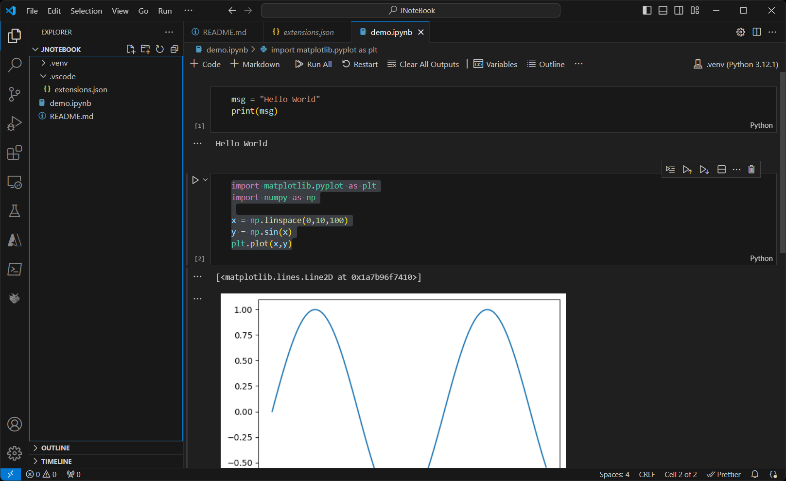

# Running Jupyter Notebooks on Windows with VSCode
## Prerequsites
- Window 11 Education N or similar
- Python 3.12 or greater
- VSCode 1.91 or later

- VScode Extenstions:
    - ms-toolsai.jupyter
    - ms-python.vscode-pylance
    - ms-python.python

## Create a new _"Project"_
Open VSCode
From the file menu "New Window"
In the new VSCode instance click "Open Folder"
In the file dialog do NOT select a folder but right-click in the dialog and CREATE a new folder.
Select the newly created folder. 

### Create a new Virtual Environment
This will be the place where all dependcies will be installed into.
Open the Comamnd Palette (e.g. press F1 key) 
Select or enter: __Python: Create Environment__
- Select Venv
- Select Python 3.12
This will create a '.venv' folder inside your project
Open the Comamnd Palette (e.g. press F1 key) 
Select or enter __Python: Select Interpreter__
- Select the interpreter that was created in the previous step. E.g.: ".\.venv\Scripts\python.exe"

### Install Dependencies
Open a terminal inside VSCode (e.g. Cltrl `)
pip install all dependencies: E.g.: "pip install jupyter matplotlib"

### Create a Jupyter Notebook:
Open the Comamnd Palette (e.g. press F1 key) 
Select or enter __Create: New Jupyter Notebook__

Enter something simple:
```python
msg = "Hello World"
print(msg)
```

Click the run button. In the Command Palette select your python environment. E.g.: .\.venv\Scripts\python.exe

Create a new cell (click '+ Code') and use the dependencies:

```
import matplotlib.pyplot as plt
import numpy as np

x = np.linspace(0,10,100)
y = np.sin(x)

plt.plot(x,y)
```
Click the run button.


